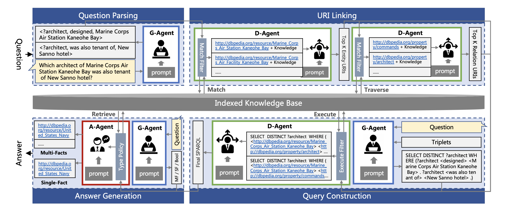

# Triad: A Framework Leveraging a Multi-Role LLM-based Agent to Solve Knowledge Base Question Answering

[](https://arxiv.org/abs/2402.14320)



## Environment Preparation
Our work is based on an existing Knowledge-base Database, and before running this code, a fully deployed Knowledge Base is required. We recommend using Virtuoso for deployment, with the recommended version being `07.20.3237`. You can refer to the documentation below for guidance on deploying the knowledge base. We are working hard to release a Docker image containing the KB we used, which will be available soon.

Additionally, an essential prerequisite for our work is indexing the entities and relationships in the KB to accelerate subsequent processes. We used Elastic Search for this, with the version being 7.5.2. You will need to deploy an ES endpoint to support this process. Moreover, you will need to export the entities from the knowledge base as ttl files, which can be done by following the Virtuoso documentation. The files should be placed in the directory `kb/<kb-name>/<kb-version>/labels.ttl`, for example, `kb/dbpedia/2016-10/labels.ttl`. Once the export is complete, run `kb_linker.py` to create the ES index.

Before running our code, you can install the necessary third-party libraries using the following command.
```shell
pip install -r requirements.txt
```

## Run Code
After setting up the environment, you can proceed to configure and run our code as follows:
1. Enter your OpenAI Key in the `openai.key` file.
2. Create the necessary configuration in the `./conf` folder. We have provided four configurations as references.
3. Run `evaluator.py` with the following command:
   ```shell
   python -m evaluator --config_path "<your-config-name>"
   ```
   For example:
   ```shell
   python -m evaluator --config_path 'lc-quad-1.0.conf'
   ```
4. After the code runs, you can find the results of your run in the `./results` folder.

## Citation
```
@misc{zong2024triadframeworkleveragingmultirole,
      title={Triad: A Framework Leveraging a Multi-Role LLM-based Agent to Solve Knowledge Base Question Answering}, 
      author={Chang Zong and Yuchen Yan and Weiming Lu and Jian Shao and Eliot Huang and Heng Chang and Yueting Zhuang},
      year={2024},
      eprint={2402.14320},
      archivePrefix={arXiv},
      primaryClass={cs.CL},
      url={https://arxiv.org/abs/2402.14320}, 
}
```
